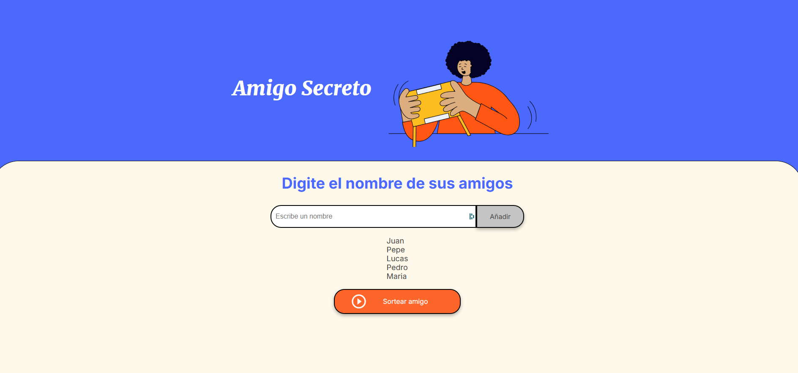

# Amigo Secreto 🎁

Una aplicación web simple y divertida para organizar sorteos de amigo secreto.



## 🚀 Características

- Agregar participantes al sorteo
- Validación de nombres duplicados
- Sorteo aleatorio automático
- Interfaz intuitiva y responsiva
- Visualización clara de los resultados

## 💻 Tecnologías Utilizadas

- HTML5
- CSS3
- JavaScript Vanilla

## 🛠️ Instalación

1. Clona este repositorio:

```bash
git clone https://github.com/Tucno0/challenge-amigo-secreto.git
```

2. Abre el archivo `index.html` en tu navegador web preferido.

## 📝 Cómo Usar

1. Ingresa el nombre de un participante en el campo de texto
2. Haz clic en "Añadir"
3. Repite el proceso hasta agregar todos los participantes
4. Presiona el botón "Sortear amigo" para realizar el sorteo
5. Los resultados se mostrarán en pantalla

## ⚠️ Consideraciones

- Se necesitan al menos 2 participantes para realizar el sorteo
- No se permiten nombres duplicados

## 📄 Licencia

Este proyecto está bajo la Licencia MIT - mira el archivo [LICENSE.md](LICENSE.md) para detalles.

## ✨ Contribución

Las contribuciones son bienvenidas. Para cambios importantes:

1. Haz Fork del repositorio
2. Crea una nueva rama
3. Envía un Pull Request

---

Desarrollado con ❤️ como parte del Challenge de Alura LATAM
